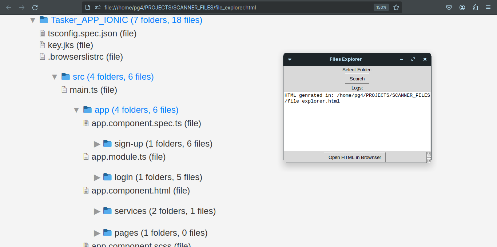

### Project: File Explorer with Graphical Interface in Python

 

**Description:**

This project creates a file explorer application using Python, with a graphical interface via Tkinter, to navigate and visualize the structure of folders and files. It generates an HTML preview of the selected directory structure, which can be opened in the browser.

**Functionalities:**
- **Folder and File Count:** Functions to count the number of folders and files within a directory.
- **HTML Generation:** Creates an HTML file that represents the structure of selected directories and files, with interactivity to expand and collapse folders.
- **Graphical Interface:** Uses Tkinter to allow the user to select a directory and view logs.
- **Opening HTML in the Browser:** Allows you to open the generated HTML file directly in the browser.

**Technical details:**
- **Count:** Functions `count_folders_in_folder` and `count_files_in_folder` to count folders and files in a directory.
- **HTML generation:** `generate_file_explorer_html` function to create the HTML structure recursively.
- **HTML Interactivity:** Adds CSS and JavaScript to HTML to allow folders to be expanded or collapsed.
- **Tkinter:** Graphical interface with buttons to explore folders and open HTML in the browser.

**How ​​it works:**
1. **Folder Selection:** The user selects a folder through the Tkinter interface.
2. **HTML generation:** The program generates an HTML file with the directory and file structure of the selected folder.
3. **View:** The user can open the generated HTML in the browser to view the folder and file structure.

**Graphic Interface Code:**
- Buttons to explore folders and open the generated HTML.
- Log area to show messages and the path of the generated HTML.

### Example of use

1. Run the Python script.
2. Click the "Browse" button to select a folder.
3. The program generates a file `file_explorer.html`.
4. Click the "Open HTML in browser" button to view the folder structure in the browser.
